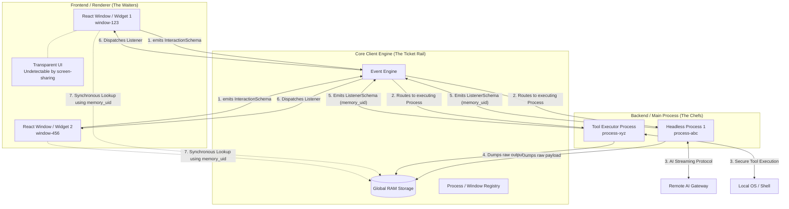

# Project Architecture: The 5-Layer Ecosystem

The application is structured into **5 distinct layers** to ensure maximum decoupling, high performance, and complete separation between UI and AI logic.

## 1. Global Transparent Layer
The absolute base of the application. It is a single, fullscreen Tauri window configured to be transparent and click-through by default. The transparent layer is governed by runtime config, especially `window.mouse_focus_enabled`, so the overlay can remain pass-through unless mouse capture is explicitly allowed.

## 2. Global Storage RAM & Classification
The single source of truth for all heavy data (managed by `useStorageEngine`). 
*   **RAM Store**: Holds massive strings (like deeply nested JSON or 10-page AI responses) mapped to a unique `memory_uid`.
*   **RAM Classification**: Indexes `memory_uid`s by type (e.g., `type:chat_history`, `process:gateway_123`), allowing Components to efficiently observe entire categories of data without pulling down the whole database.

## 3. Window (The Dumb Frame)
The physical "glass" containers floating on the Transparent Layer. Windows contain Components.
*   **Responsibilities**: Handles X/Y coordinates, screen size manipulation, dragging, z-index, and focus.
*   **Rule**: It has zero business logic and does not care what Component is inside it.

## 4. Component (The Active UI)
The reactive UI tools inside the Windows (e.g., `<ChatBubble />`, `<SystemMonitor />`).
*   **Responsibilities**: Renders DOM elements based on data it observes in the Global Storage RAM.
*   **Capabilities**: It catches user input and **emits** `InteractionSchema` events. It **listens** to `ListenerSchema` events to know when to refresh or observe a new RAM classification.

## 5. Event Engine & Process Engine (The Backend)
The intelligent routers and executors.
*   **Event Engine**: The message broker. It receives `InteractionSchema` payloads from Components and routes them to the correct Process. It receives `ListenerSchema` payloads from Processes and drops them into the listening Component's buffer.
*   **Process Engine**: The headless task manager. It executes complex actions on demand and supervises subordinate engines such as `aiParserEngine`, `fsEngine`, `shellEngine`, `toolsEngine`, `aiGatewayEngine`, and `pipelineEngine`. Processes have a `group_pid` (to track who spawned whom) and can dynamically spawn sub-processes.

## Core Managers

- `storageEngine`: Global RAM and classification memory.
- `eventEngine`: System-wide intent router.
- `processEngine`: On-demand task orchestrator.
- `windowEngine`: Window and transparent layer orchestrator.
- `globalStateManager`: Cursor, focus, active config, and active/running keybind tracker.



---

## Example Workflow: "Prompting Open X"

When the user types a prompt like "open the system monitor" into a Chat Component, the following 5-layer workflow triggers:

1.  **Component Emits**: The `<ChatBubble />` component emits an `InteractionSchema` (`action: send`, `sub_action: send_gateway`).
2.  **Event Engine Routes**: The Event Engine receives the ticket.
    *   It checks the **Process Engine** if there is already an active AI Gateway connection process handling this specific chat session.
    *   If not, the Process Engine dynamically **spawns a new API Gateway Process**.
3.  **Process Tells Component to Watch**: The Gateway Process tells the invoking Component: *"Hey, I'm streaming data into Global RAM under the classification `process_gateway_123`. Listen to this."*
4.  **Process Streams**: The Gateway Process streams the LLM tokens directly into the Global RAM buffer. The Component, purely through observability, sees the RAM changing and reactively updates the screen.
5.  **Parser Sub-Process Spawns**: Simultaneously, a separate **AI Parser Process** is spun up by the Process Engine. It reads the AI's markdown block line-by-line as it streams.
6.  **Tool Sub-Process Spawns**: If the Parser Process reads ````event interaction, null, null, null, open, open_widget {"widget": "system_monitor"} ````, it immediately tells the Process Engine to spawn a *new* **Tool Executor Process** to actually run that command without blocking the main Gateway stream!
