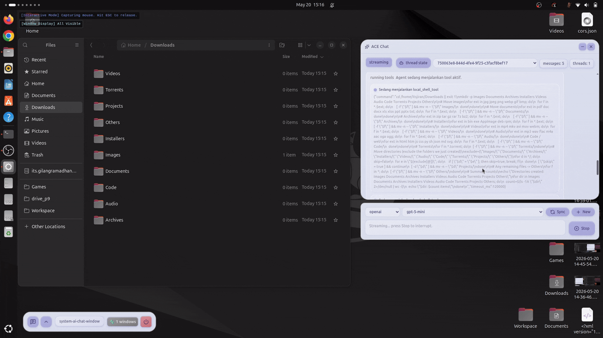
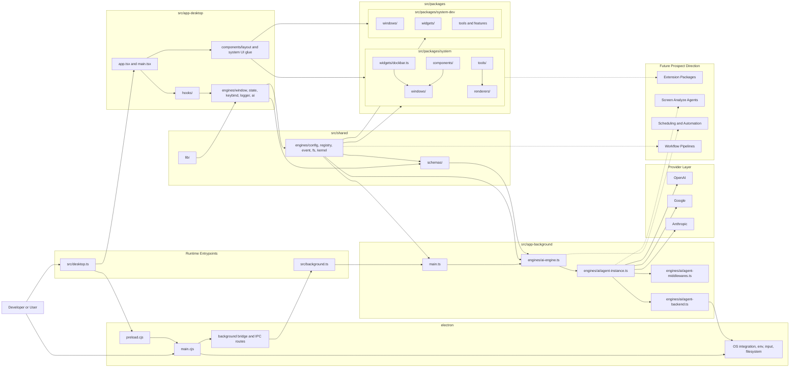

# ACE-Agentic-Client-Environment

<p align="center">
	
</p>


> Project Status: ACE is an active experimental developed as a side project alongside my full-time work, marking my first implementation of AI agents using the DeepAgents framework. To maintain high velocity within a limited timeline, I have heavily leveraged AI-assisted development to scaffold and iterate on core ideas. Although the project is heavily curated and performance is already solid, the high complexity and rapid development pace mean you should expect some architectural awkwardness, volatile schemas, and structural inconsistencies. I’m sharing this early to gather feedback on the vision of a local-first, overlay-driven workspace, and I appreciate your patience as I work to refine these early experimental patterns into a more hardened and elegant architecture.

---------

ACE is a local-first agentic desktop environment built around an overlay UI, an Electron desktop shell, a desktop runtime, and a background agent runtime.

The project is designed to help developers work faster by combining:
- an always-available overlay interface
- AI-assisted chat and orchestration
- local tool execution inside the app
- session context, memory, and retrieval pipelines
- an extensible package ecosystem for custom components, tools, and workflows

In practical terms, ACE is an experimental developer assistant platform where the overlay UI, runtime orchestration, package registry, and agent runtime are already usable, but still moving toward cleaner boundaries.

## ✨ Key Features

- **🌐 Always-on Overlay:** A seamless UI layer that stays on top of your workflow without interrupting it.
- **🧠 Local-First Intelligence:** Privacy-centric AI orchestration with an Electron-hosted background DeepAgents runtime and live renderer streaming.
- **🛠️ Extensible Toolchain:** Registry-loaded tools, package-defined windows/widgets, and runtime-safe bridges for desktop and background capabilities.
- **📡 Event-Driven Architecture:** Robust communication via a central `EventBus` for decoupled UI and logic.
- **📦 Package Ecosystem:** Modular architecture allowing custom widgets, tools, and workflows.


## 🖥️ Demos

<table width="100%">
  <tr>
    <td width="50%" align="center">
      <!-- GIF 1: Sistem Windowing / Devkit -->
      
    </td>
    <td width="50%" align="center">
      <!-- GIF 2: Proses Deepagents / Langchain -->
      
    </td>
  </tr>
</table>

<p align="center">
  <br />
  <!-- TOMBOL FULL DEMO -->
  <a href="https://youtu.be/f9zeMf6KNdQ" target="_blank">
    
  </a>
</p>

## 💡 Why ACE?

Context switching kills user productivity. Modern AI assistants often live in separate browser tabs or restricted IDE sidebars. ACE aims to bridge this gap by providing a **Unified Agentic Surface** that lives where you work, with direct access to your local runtime and tools given the extendability for window, tool and etc.

## Getting Started

### Prerequisites

- Node.js and npm

### Install Dependencies

```bash
npm install
```

### Configure Provider API Keys

ACE reads provider keys from your shell environment through the Electron main process and exposes only an allowlisted subset to the renderer.

For example in `~/.zshrc`:

```bash
export OPENAI_API_KEY="your-key"
export ANTHROPIC_API_KEY="your-key"
export GOOGLE_API_KEY="your-key"
```

Then restart your terminal and Electron dev process.

### Temporary Filesystem Security Note

ACE currently runs DeepAgents with filesystem permissions explicitly set to allow both `read` and `write` operations across all mounted backend routes used by the MVP runtime.

This is a deliberate temporary tradeoff for MVP velocity so the local agent can inspect, edit, delete, rewrite, and persist project artifacts without friction while the tool/runtime contract is still settling.

In practical terms for the current MVP state, ACE is intentionally permissive across the routed home-directory filesystem mount, so the agent can operate on files under the mounted home path without fine-grained resolution yet.

The current workflow also allows command execution for MVP iteration, which means batch-edit scripts, temporary shell helpers, and command-driven file transformations are intentionally available while stricter policy layers are still pending.

Important caveats for the current MVP state:
- this is not a hardened least-privilege policy yet
- filesystem access is intentionally permissive for agent workflows during rapid iteration, including the routed home filesystem mount
- bulk file changes may currently be performed through temporary shell scripts or command-driven workflows for speed and consistency
- stronger route-scoped and tool-scoped permission rules should be added before treating the runtime as production-hardened

In short: the current filesystem permission model is intentionally permissive for experimentation, including broad home-route access for MVP workflows, and that should be treated as a temporary security issue accepted for MVP delivery rather than a final posture.

### Run The App

Start the desktop app:

```bash
npm run start
```

```bash
npm run dev
```

This starts:
- the Vite renderer dev server
- the Electron main process

### Optional Legacy Gateway Scripts

The repository still contains legacy gateway-oriented scripts in `package.json` such as `setup:gateway`, `dev:gateway`, and `dev:with-gateway`.

Those scripts are not the primary local workflow anymore. The active AI flow now runs through the Electron desktop renderer plus the dedicated background runtime under `src/app-background/`.

### Typical Local Workflow

1. install npm dependencies
2. export provider API keys in your shell config
3. restart the shell so the variables are available
4. run `npm run dev`

## Current State

ACE is currently an experimental platform for building a local-first AI-native workspace, with a strong focus on developer productivity.

The current implementation is important to state clearly:
- the overlay UI runs in a React renderer powered by Vite under `src/app-desktop/`
- the desktop host runs in Electron through `electron/main.cjs` and `electron/preload.cjs`
- the shared control plane and runtime-safe contracts live under `src/shared/`
- the active DeepAgents runtime runs in a dedicated background process under `src/app-background/`
- the renderer and background runtime communicate through Electron IPC and a local stream bridge

## What This Project Is

Today, the codebase includes work on:
- overlay and window-based UI primitives
- a kernel-like local runtime for memory, process orchestration, config, input, registry, and filesystem access
- a background DeepAgents integration for local agent execution
- session state, context, memory, and retrieval flows
- local tool execution through package registry domains and runtime bridges
- package-driven extensibility for future third-party or internal feature development

## Current Implementation

Even though the project is still early, a meaningful amount of the runtime foundation is already implemented.

What is currently implemented in the repository:
- a working desktop runtime built with React, Vite, and Electron
- a central `KernelEngine` control plane for memory, process lifecycle, runtime state, and orchestration helpers
- an `EventBus`-driven interaction system for routing actions like tool execution and system events across the app
- configuration, keybind, filesystem, window, logging, registry, and AI engines split across `src/app-desktop/`, `src/app-background/`, and `src/shared/`
- a background DeepAgents runtime created from `src/app-background/engines/ai/agent-instance.ts`
- provider/model integration plumbing for OpenAI, Google, and Anthropic through the in-app AI runtime
- AI thread state synchronization into kernel memory through `AIEngine`
- Electron bridges for filesystem access, global mouse/keyboard input, shell-derived environment variables, and background event streaming
- registry-driven package loading for windows, widgets, tools, features, and renderers
- system surfaces such as chat, settings, runtime monitors, and a dockbar-style launcher window
- a package-oriented architecture with components, widgets, layout primitives, and development surfaces
- a non-trivial automated test surface across config, filesystem, eventing, kernel behavior, and related orchestration slices

In short, the current architecture is real and usable, but still transitional: the desktop shell, kernel-like control plane, package registry, and background agent runtime are already present, while stronger contracts and cleaner long-term boundaries are still being hardened.

## Current Engine Surfaces

The current engine layer is centered on these runtime domains:
- `KernelEngine`: control plane for system memory, process lifecycle, and orchestration helpers
- `ConfigEngine`: schema-driven config persistence with versioned files and kernel RAM sync
- `FSEngine`: local file persistence with Electron-backed adapters and fallback behavior
- `WindowEngine`: desktop/window coordination, overlay interaction, and global input routing
- `KeybindEngine`: active keybind resolution and input-driven command dispatch
- `RegistryEngine`: package and runtime registration surface
- `AIEngine`: AI thread state, provider/model helpers, background thread orchestration, and live stream synchronization
- `EventEngine` / `EventBus`: decoupled routing layer for runtime events

## 🛠 Technical Decisions & AI Implementation

### Why DeepAgents + LangChain?
The AI agent intelligence in ACE currently uses **DeepAgents** built on top of **LangChain**, executed in an Electron-managed background runtime. While many frameworks exist, this choice was driven by a need for high-speed delivery without sacrificing orchestration power:

*   **Speed over Boilerplate:** Leveraging a pre-built agentic framework allowed me to focus on ACE's unique overlay logic rather than building a custom **LangGraph** from scratch. Managing complex nodes, edges, and state transitions manually would have significantly delayed the experimental cycle.
*   **ReAct vs. Custom Loops:** Implementing a reliable **ReAct** (Reasoning and Acting) pattern is non-trivial. DeepAgents provides a battle-tested execution loop that handles tool calling and observation cycles out of the box.
*   **LangChain Ecosystem:** By using LangChain as the backbone, ACE stays compatible with a vast ecosystem of document loaders, retrievers, and model providers, ensuring the "local-first" vision remains flexible.

### Deep Dive & Developer Logs
For a more detailed technical breakdown, architectural logs, and the journey of building ACE, check out my blog:
👉 **[jiran.dev/projects/ace](https://jiran.dev/projects/ace)**

## Architecture Overview

At a high level, ACE is structured around the real runtime entrypoints and package surfaces that exist in this repository today. `src/desktop.ts` boots the renderer-side desktop runtime. `src/background.ts` boots the dedicated background runtime. `src/shared/` provides the common contracts and core engines. `src/packages/` contributes registry-loaded windows, widgets, tools, renderers, and related package surfaces that are mounted into the running system.



### How The Layers Work Together

- `src/desktop.ts` boots the renderer-side runtime by composing desktop-facing engines such as `WindowEngine`, `StateEngine`, `KeybindEngine`, `LoggerEngine`, and desktop `AIEngine` on top of shared contracts.
- `src/app-desktop/` owns renderer UI, hooks, window shells, and interaction logic, while package windows and widgets from `src/packages/system/` and `src/packages/system-dev/` provide much of the actual mounted UI surface.
- `src/shared/engines/` contains the common control-plane layer, especially `KernelEngine`, `RegistryEngine`, `ConfigEngine`, `EventBus`, and filesystem-facing shared runtime contracts.
- Electron `main.cjs`, `preload.cjs`, and the background bridge connect the desktop runtime to host capabilities such as environment access, filesystem access, global input, and background IPC.
- `src/background.ts` and `src/app-background/main.ts` boot the dedicated background runtime, where background `AIEngine` invokes the DeepAgents instance and emits stream updates back toward the renderer.
- DeepAgents-specific composition currently lives under `src/app-background/engines/ai/`, including the agent instance, middleware stack, backend wiring, and tool-facing integration points.
- AI streaming and persisted thread synchronization flow through shared kernel state so windows like chat and monitors can reflect both live and durable runtime state.
- The architecture already reflects a practical split between desktop, background, shared, electron, and package layers; the main ongoing task is reducing leakage between those real surfaces rather than inventing a new separation model.

### Runtime Flow In Practice

1. A user action starts from an overlay surface such as chat, dockbar, or a system window.
2. Renderer-side components call into desktop engines and shared contracts rather than directly mutating host state.
3. Desktop engines persist durable state into `KernelEngine` and route interactions through `RegistryEngine` or `EventBus` when appropriate.
4. When AI execution is needed, desktop `AIEngine` forwards the request through Electron IPC into the dedicated background runtime.
5. Background `AIEngine` invokes the DeepAgents instance, which resolves middlewares, tools, backends, and provider calls.
6. Tool output, stream events, and thread snapshots are synchronized back into kernel memory and then reflected into renderer windows.
7. The renderer consumes that shared state to keep chat, monitors, and other package-driven surfaces live and in sync.


## 🗺️ Current Roadmap

- [x] Core KernelEngine and EventBus Implementation
- [x] Electron background DeepAgents runtime with multi-provider support
- [ ] **Phase 1:** Hardening the tool execution pipeline
- [ ] **Phase 2:** Stabilize AI runtime state, provider model sync, and session boundaries
- [ ] **Phase 3:** Split architecture into clearer app, server, and shared surfaces
- [ ] **Phase 4:** Advanced Memory & RAG retrieval systems
- [ ] **Phase 5:** Public Package Registry for community modules

## Future Prospects

The future direction of ACE is not only “more chat features”. The longer-term goal is to turn the current overlay plus runtime foundation into a programmable agentic workstation where AI can operate with stronger situational awareness, controlled automation, and package-level extensibility.

Some of the clearest next prospect areas are:
- **Extension Packages:** a stronger package contract so third-party or internal modules can contribute windows, widgets, tools, parsers, workflows, and background capabilities without patching the core runtime directly.
- **Screen Analyze Agentics:** a future agent layer that can reason about the visible desktop state more directly, including screen context, active windows, layout state, and eventually richer screen analysis for UI-aware assistance.
- **Scheduling and Background Automation:** scheduled tasks, recurring jobs, reminder-like automations, queued workflows, and agent-triggered routines that continue running in the background runtime.
- **Workflow Pipelines:** more explicit multi-step agent workflows for coding, research, project setup, local automation, and cross-tool orchestration instead of only single-turn chat interactions.
- **Assistive System Surfaces:** richer monitors, planners, execution dashboards, runtime inspectors, and package-provided operational windows so agent behavior is easier to inspect and control.
- **Safer Execution Contracts:** tighter policy layers for filesystem access, tool permissions, scheduling ownership, and package isolation so future automation remains observable and bounded.

Put differently: the present repository is the start of a local-first agent runtime plus overlay shell, while the future prospect is a broader extensible workstation where packages, automation, memory, vision-like screen analysis, and agent scheduling all compose cleanly around the same kernel and registry model.

## Architecture Split Status

The split has already started and the current repository is organized around these practical surfaces:
- `src/app-desktop`: renderer UI, hooks, overlay behavior, and desktop-facing engines
- `src/app-background`: background AI runtime, DeepAgents integration, and registry-backed tools
- `src/shared`: schemas, engine facades, contracts, and runtime-safe shared state models
- `electron/`: main/preload runtime and OS integration

The next step is not a cosmetic rename. It is to keep reducing leakage between these surfaces so renderer concerns, agent execution concerns, and host concerns stay independently testable.

The end goal is an extensible developer environment where AI, runtime tools, overlay UI, package modules, and session intelligence work together in a clean and durable architecture.

## 📄 License

MIT License
Copyright (c) 2026 [Jibril Gilang Ramadhan]
