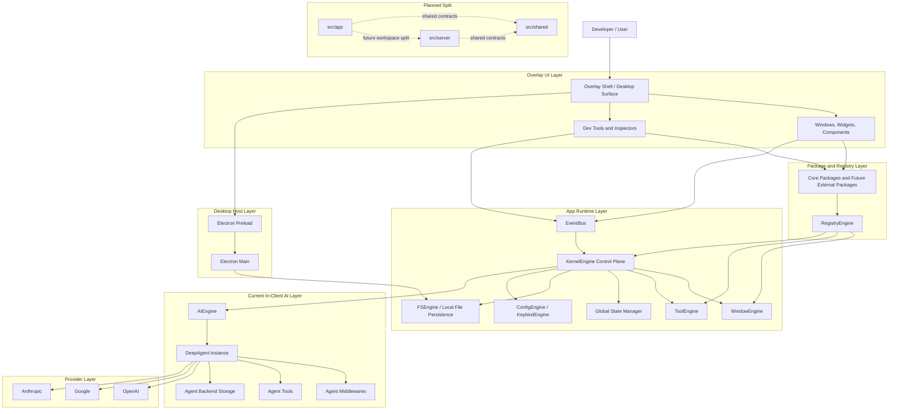

# ACE-Agentic-Client-Environment


> Project Status: ACE is an active experimental developed as a side project alongside my full-time work, marking my first implementation of AI agents using the DeepAgents framework. To maintain high velocity within a limited timeline, I have heavily leveraged AI-assisted development to scaffold and iterate on core ideas. Although the project is heavily curated and performance is already solid, the high complexity and rapid development pace mean you should expect some architectural awkwardness, volatile schemas, and structural inconsistencies. I’m sharing this early to gather feedback on the vision of a local-first, overlay-driven workspace, and I appreciate your patience as I work to refine these early experimental patterns into a more hardened and elegant architecture.

---------

ACE is a local-first agentic desktop environment built around an overlay UI, an Electron desktop shell, and a runtime tool/event architecture.

The project is designed to help developers work faster by combining:
- an always-available overlay interface
- AI-assisted chat and orchestration
- local tool execution inside the app
- session context, memory, and retrieval pipelines
- an extensible package ecosystem for custom components, tools, and workflows

In practical terms, ACE is an experimental developer assistant platform where the UI layer, runtime orchestration, and agent runtime are still evolving toward a cleaner multi-surface architecture.

## ✨ Key Features

- **🌐 Always-on Overlay:** A seamless UI layer that stays on top of your workflow without interrupting it.
- **🧠 Local-First Intelligence:** Privacy-centric AI orchestration with a local runtime, with the current DeepAgents loop still living on the client side.
- **🛠️ Extensible Toolchain:** Schema-aware tool execution (`ToolEngine`) for local file and system tasks.
- **📡 Event-Driven Architecture:** Robust communication via a central `EventBus` for decoupled UI and logic.
- **📦 Package Ecosystem:** Modular architecture allowing custom widgets, tools, and workflows.

## 💡 Why ACE?

Context switching kills user productivity. Modern AI assistants often live in separate browser tabs or restricted IDE sidebars. ACE aims to bridge this gap by providing a **Unified Agentic Surface** that lives where you work, with direct access to your local runtime and tools given the extendability for window, tool and etc.

## Getting Started

### Prerequisites

- Node.js and npm

### Install Dependencies

```bash
npm install
```

### Configure Provider API Keys

ACE reads provider keys from your shell environment through the Electron main process and exposes only an allowlisted subset to the renderer.

For example in `~/.zshrc`:

```bash
export OPENAI_API_KEY="your-key"
export ANTHROPIC_API_KEY="your-key"
export GOOGLE_API_KEY="your-key"
```

Then restart your terminal and Electron dev process.

### Run The App

Start the desktop app:

```bash
npm run dev
```

This starts:
- the Vite renderer dev server
- the Electron main process

### Optional Legacy Gateway Scripts

The repository still contains legacy gateway-oriented scripts in `package.json` such as `setup:gateway`, `dev:gateway`, and `dev:with-gateway`.

Those scripts are not the primary local workflow anymore because the current DeepAgents runtime is instantiated inside the client application under `src/engines/ai/`.

### Typical Local Workflow

1. install npm dependencies
2. export provider API keys in your shell config
3. restart the shell so the variables are available
4. run `npm run dev`

## Current State

ACE is currently an experimental platform for building a local-first AI-native workspace, with a strong focus on developer productivity.

The current implementation is important to state clearly:
- the overlay UI runs in a React renderer powered by Vite
- the desktop host runs in Electron through `electron/main.cjs` and `electron/preload.cjs`
- the app runtime lives in `src/engines`, centered around `KernelEngine` and domain engines
- the active DeepAgents runtime currently lives on the client side in `src/engines/ai/`
- a fuller server split is planned, but it is not the primary runtime path today

## What This Project Is

Today, the codebase includes work on:
- overlay and window-based UI primitives
- a kernel-like local runtime for memory, process orchestration, config, input, registry, and filesystem access
- a client-side DeepAgents integration for local agent execution
- session state, context, memory, and retrieval flows
- local tool execution through an internal event/runtime system
- package-driven extensibility for future third-party or internal feature development

## Current Implementation

Even though the project is still early, a meaningful amount of the runtime foundation is already implemented.

What is currently implemented in the repository:
- a working desktop runtime built with React, Vite, and Electron
- a central `KernelEngine` control plane for memory, process lifecycle, runtime state, and orchestration helpers
- an `EventBus`-driven interaction system for routing actions like tool execution and system events across the app
- configuration, keybind, filesystem, window, logging, registry, and AI engines under `src/engines`
- a client-side DeepAgents runtime created in `src/engines/ai/agent-instance.ts`
- provider/model integration plumbing for OpenAI, Google, and Anthropic through the in-app AI runtime
- AI thread state synchronization into kernel memory through `AIEngine`
- Electron bridges for filesystem access, global mouse/keyboard input, and shell-derived environment variables
- a package-oriented architecture with components, widgets, layout primitives, and development surfaces
- a non-trivial automated test surface across config, filesystem, eventing, kernel behavior, and related orchestration slices

In short, the current architecture is real and usable, but still transitional: the app shell, kernel-like control plane, local agent runtime, and tool execution path are already present, while the clean separation into dedicated app/server/shared surfaces is still ahead.

## Current Engine Surfaces

The current engine layer is centered on these runtime domains:
- `KernelEngine`: control plane for system memory, process lifecycle, and orchestration helpers
- `ConfigEngine`: schema-driven config persistence with versioned files and kernel RAM sync
- `FSEngine`: local file persistence with Electron-backed adapters and fallback behavior
- `WindowEngine`: desktop/window coordination, overlay interaction, and global input routing
- `KeybindEngine`: active keybind resolution and input-driven command dispatch
- `RegistryEngine`: package and runtime registration surface
- `AIEngine`: AI thread state, provider/model helpers, and kernel synchronization
- `EventEngine` / `EventBus`: decoupled routing layer for runtime events

## 🛠 Technical Decisions & AI Implementation

### Why DeepAgents + LangChain?
The AI agent intelligence in ACE currently uses **DeepAgents** built on top of **LangChain**, and right now that runtime still lives inside the client application. While many frameworks exist, this choice was driven by a need for high-speed delivery without sacrificing orchestration power:

*   **Speed over Boilerplate:** Leveraging a pre-built agentic framework allowed me to focus on ACE's unique overlay logic rather than building a custom **LangGraph** from scratch. Managing complex nodes, edges, and state transitions manually would have significantly delayed the experimental cycle.
*   **ReAct vs. Custom Loops:** Implementing a reliable **ReAct** (Reasoning and Acting) pattern is non-trivial. DeepAgents provides a battle-tested execution loop that handles tool calling and observation cycles out of the box.
*   **LangChain Ecosystem:** By using LangChain as the backbone, ACE stays compatible with a vast ecosystem of document loaders, retrievers, and model providers, ensuring the "local-first" vision remains flexible.

### Deep Dive & Developer Logs
For a more detailed technical breakdown, architectural logs, and the journey of building ACE, check out my blog:
👉 **[jiran.dev/projects/ace](https://jiran.dev/projects/ace)**

## Architecture Overview

At a high level, ACE is currently structured as a layered desktop runtime inside one application package. The top layer is the overlay UI and package-driven React surface. Under that sits the app runtime, which routes events, manages memory and processes, and coordinates windows, tools, layouts, sessions, and the current in-client DeepAgents runtime. The long-term target is to split these concerns more cleanly into app, server, and shared surfaces.



### How The Layers Work Together

- The user interacts with the overlay UI, which renders windows, widgets, chat surfaces, and developer monitors.
- Those surfaces are mounted from package definitions and resolved through the registry layer.
- Runtime actions are routed through the app control plane, centered around `KernelEngine`, `EventBus`, and domain engines such as `WindowEngine`, `ConfigEngine`, `FSEngine`, `KeybindEngine`, and `AIEngine`.
- The Electron host layer exposes desktop capabilities such as filesystem access, global input, and shell-derived environment variables through the preload bridge.
- The current DeepAgents runtime is instantiated locally inside `src/engines/ai/agent-instance.ts`, with tools, middlewares, and backend storage wired in-process.
- Provider selection, API key injection, thread synchronization, and available-model caching are currently handled inside the app runtime rather than through a dedicated external server.
- The architecture is intentionally moving toward a cleaner split where app UI, server-side agent orchestration, and shared contracts can evolve as separate surfaces without breaking the current runtime.


## 🗺️ Current Roadmap

- [x] Core KernelEngine and EventBus Implementation
- [x] In-client DeepAgents runtime with multi-provider support
- [ ] **Phase 1:** Hardening the tool execution pipeline
- [ ] **Phase 2:** Stabilize AI runtime state, provider model sync, and session boundaries
- [ ] **Phase 3:** Split architecture into clearer app, server, and shared surfaces
- [ ] **Phase 4:** Advanced Memory & RAG retrieval systems
- [ ] **Phase 5:** Public Package Registry for community modules

## Roadmap For Architecture Split

The current runtime is intentionally transitional. The likely next structural move is a workspace-style split, still inside one repository, along these lines:
- `src/app`: renderer UI, overlay runtime, hooks, visual components, and app-facing engines
- `src/server`: future backend agent runtime, orchestration endpoints, provider adapters, and long-lived session execution
- `src/shared`: schemas, transport contracts, DTOs, constants, and other runtime-safe shared modules
- `electron/`: desktop host runtime for main/preload and OS integration

The purpose of that split is not cosmetic. It is mainly to separate:
- UI concerns from server-side orchestration concerns
- desktop host concerns from agent runtime concerns
- shared protocol contracts from implementation details

## Long-Term Roadmap

The broader direction of the project is no longer just feature expansion. A major part of the roadmap is hardening and cleaning up the architecture that is currently still heavily vibe-coded and experimental.

Key long-term priorities:
- harden and simplify the current AI runtime so tool execution, session flow, and orchestration are more deterministic and observable
- migrate the current in-client agent runtime toward a cleaner dedicated server surface when the contract layer is stable enough
- clean up and stabilize the current architecture so core concepts have clearer boundaries and fewer ad hoc flows
- add stronger windowing and batching systems for context, memory, and retrieval so session state can scale more safely
- improve memory, retrieval, and context assembly into a more reliable pipeline with better lifecycle control
- expand the package registry system so developers can extend the app with their own tools, UI modules, workflows, and runtime integrations

The end goal is an extensible developer environment where AI, runtime tools, overlay UI, package modules, and session intelligence work together in a clean and durable architecture.

## 📄 License

MIT License
Copyright (c) 2026 [Jibril Gilang Ramadhan]