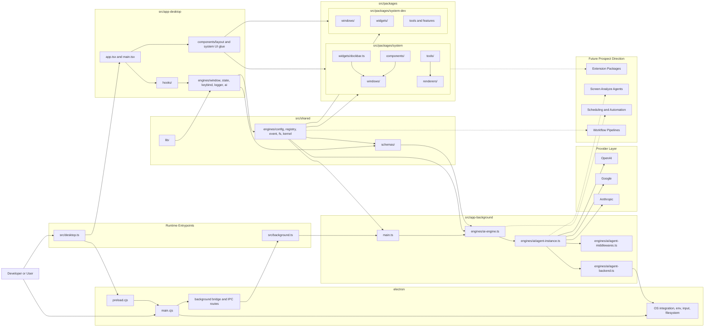

# ACE-Agentic-Client-Environment

<p align="center">
	
</p>


---------

ACE is a local-first agentic desktop environment built around an overlay UI, an Electron desktop shell, a desktop runtime, and a background agent runtime.

The project is designed to help developers work faster by combining:
- an always-available overlay interface
- AI-assisted chat and orchestration
- local tool execution inside the app
- session context, memory, and retrieval pipelines
- an extensible package ecosystem for custom components, tools, and workflows

In practical terms, ACE is an experimental developer assistant platform where the overlay UI, runtime orchestration, package registry, and agent runtime are already usable, but still moving toward cleaner boundaries.

## ✨ Key Features

- **🌐 Always-on Overlay:** A seamless UI layer that stays on top of your workflow without interrupting it.
- **🧠 Local-First Intelligence:** Privacy-centric AI orchestration with an Electron-hosted background DeepAgents runtime and live renderer streaming.
- **🛠️ Extensible Toolchain:** Registry-loaded tools, package-defined windows/widgets, and runtime-safe bridges for desktop and background capabilities.
- **📡 Event-Driven Architecture:** Robust communication via a central `EventBus` for decoupled UI and logic.
- **📦 Package Ecosystem:** Modular architecture allowing custom widgets, tools, and workflows.


## 🖥️ Demos

<table width="100%">
  <tr>
    <td width="50%" align="center">
      <!-- GIF 1: Sistem Windowing / Devkit -->
      
    </td>
    <td width="50%" align="center">
      <!-- GIF 2: Proses Deepagents / Langchain -->
      
    </td>
  </tr>
</table>

<p align="center">
  <br />
  <!-- TOMBOL FULL DEMO -->
  <a href="https://youtu.be/f9zeMf6KNdQ" target="_blank">
    
  </a>
</p>

## 💡 Why ACE?

Context switching kills user productivity. Modern AI assistants often live in separate browser tabs or restricted IDE sidebars. ACE aims to bridge this gap by providing a **Unified Agentic Surface** that lives where you work, with direct access to your local runtime and tools given the extendability for window, tool and etc.

## Getting Started

### Prerequisites

- Node.js and npm

### Install Dependencies

```bash
npm install
```

### Configure Provider API Keys

ACE reads provider keys from your shell environment through the Electron main process and exposes only an allowlisted subset to the renderer.

For example in `~/.zshrc`:

```bash
export OPENAI_API_KEY="your-key"
export ANTHROPIC_API_KEY="your-key"
export GOOGLE_API_KEY="your-key"
```

Then restart your terminal and Electron dev process.


### Run The App

Start the desktop app:

```bash
npm run start
```

```bash
npm run dev
```

This starts:
- the Vite renderer dev server
- the Electron main process

### Temporary Filesystem Security Note
MVP Security Notice: ACE intentionally runs DeepAgents with permissive read/write filesystem access and broad command execution capabilities across the mounted home directory. This is a deliberate, temporary tradeoff to maximize MVP velocity—allowing the agent to inspect, edit, and rewrite project artifacts via batch scripts and shell helpers without friction while the core runtime contracts are still settling. This current posture is not a hardened least-privilege policy; it should be treated as an accepted security issue for rapid iteration that requires strict route-scoped and tool-scoped permission layers before any production release.

### Deep Dive & Developer Logs
For a more detailed technical breakdown, architectural logs, and the journey of building ACE, check out my blog:
👉 **[jiran.dev/projects/ace](https://jiran.dev/projects/ace)**

## Architecture Overview



### How The Layers Work Together

- `src/desktop.ts` boots the renderer-side runtime by composing desktop-facing engines such as `WindowEngine`, `StateEngine`, `KeybindEngine`, `LoggerEngine`, and desktop `AIEngine` on top of shared contracts.
- `src/app-desktop/` owns renderer UI, hooks, window shells, and interaction logic, while package windows and widgets from `src/packages/system/` and `src/packages/system-dev/` provide much of the actual mounted UI surface.
- `src/shared/engines/` contains the common control-plane layer, especially `KernelEngine`, `RegistryEngine`, `ConfigEngine`, `EventBus`, and filesystem-facing shared runtime contracts.
- Electron `main.cjs`, `preload.cjs`, and the background bridge connect the desktop runtime to host capabilities such as environment access, filesystem access, global input, and background IPC.
- `src/background.ts` and `src/app-background/main.ts` boot the dedicated background runtime, where background `AIEngine` invokes the DeepAgents instance and emits stream updates back toward the renderer.
- DeepAgents-specific composition currently lives under `src/app-background/engines/ai/`, including the agent instance, middleware stack, backend wiring, and tool-facing integration points.
- AI streaming and persisted thread synchronization flow through shared kernel state so windows like chat and monitors can reflect both live and durable runtime state.
- The architecture already reflects a practical split between desktop, background, shared, electron, and package layers; the main ongoing task is reducing leakage between those real surfaces rather than inventing a new separation model.

## Future Prospects

The future direction of ACE is not only “more chat features”. The longer-term goal is to turn the current overlay plus runtime foundation into a programmable agentic workstation where AI can operate with stronger situational awareness, controlled automation, and package-level extensibility.

Some of the clearest next prospect areas are:
- **Extension Packages:** a stronger package contract so third-party or internal modules can contribute windows, widgets, tools, parsers, workflows, and background capabilities without patching the core runtime directly.
- **Screen Analyze Agentics:** a future agent layer that can reason about the visible desktop state more directly, including screen context, active windows, layout state, and eventually richer screen analysis for UI-aware assistance.
- **Scheduling and Background Automation:** scheduled tasks, recurring jobs, reminder-like automations, queued workflows, and agent-triggered routines that continue running in the background runtime.
- **Workflow Pipelines:** more explicit multi-step agent workflows for coding, research, project setup, local automation, and cross-tool orchestration instead of only single-turn chat interactions.
- **Assistive System Surfaces:** richer monitors, planners, execution dashboards, runtime inspectors, and package-provided operational windows so agent behavior is easier to inspect and control.
- **Safer Execution Contracts:** tighter policy layers for filesystem access, tool permissions, scheduling ownership, and package isolation so future automation remains observable and bounded.

Put differently: the present repository is the start of a local-first agent runtime plus overlay shell, while the future prospect is a broader extensible workstation where packages, automation, memory, vision-like screen analysis, and agent scheduling all compose cleanly around the same kernel and registry model.

## 📄 License

MIT License
Copyright (c) 2026 [Jibril Gilang Ramadhan]
