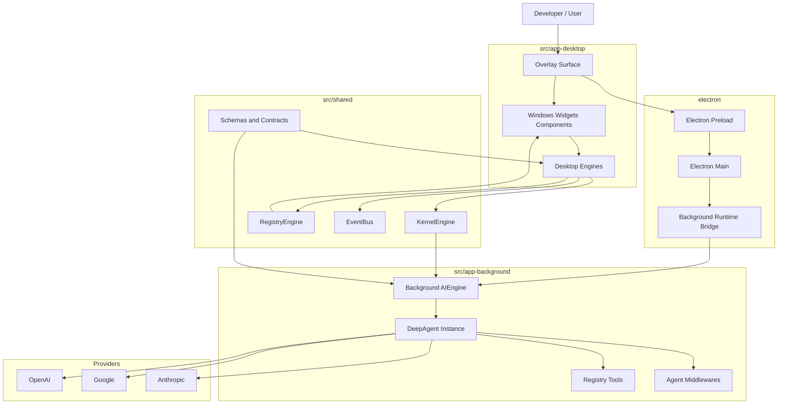

# ACE-Agentic-Client-Environment

<p align="center">
	
</p>


> Project Status: ACE is an active experimental developed as a side project alongside my full-time work, marking my first implementation of AI agents using the DeepAgents framework. To maintain high velocity within a limited timeline, I have heavily leveraged AI-assisted development to scaffold and iterate on core ideas. Although the project is heavily curated and performance is already solid, the high complexity and rapid development pace mean you should expect some architectural awkwardness, volatile schemas, and structural inconsistencies. I’m sharing this early to gather feedback on the vision of a local-first, overlay-driven workspace, and I appreciate your patience as I work to refine these early experimental patterns into a more hardened and elegant architecture.

---------

ACE is a local-first agentic desktop environment built around an overlay UI, an Electron desktop shell, a desktop runtime, and a background agent runtime.

The project is designed to help developers work faster by combining:
- an always-available overlay interface
- AI-assisted chat and orchestration
- local tool execution inside the app
- session context, memory, and retrieval pipelines
- an extensible package ecosystem for custom components, tools, and workflows

In practical terms, ACE is an experimental developer assistant platform where the overlay UI, runtime orchestration, package registry, and agent runtime are already usable, but still moving toward cleaner boundaries.

## ✨ Key Features

- **🌐 Always-on Overlay:** A seamless UI layer that stays on top of your workflow without interrupting it.
- **🧠 Local-First Intelligence:** Privacy-centric AI orchestration with an Electron-hosted background DeepAgents runtime and live renderer streaming.
- **🛠️ Extensible Toolchain:** Registry-loaded tools, package-defined windows/widgets, and runtime-safe bridges for desktop and background capabilities.
- **📡 Event-Driven Architecture:** Robust communication via a central `EventBus` for decoupled UI and logic.
- **📦 Package Ecosystem:** Modular architecture allowing custom widgets, tools, and workflows.

## 💡 Why ACE?

Context switching kills user productivity. Modern AI assistants often live in separate browser tabs or restricted IDE sidebars. ACE aims to bridge this gap by providing a **Unified Agentic Surface** that lives where you work, with direct access to your local runtime and tools given the extendability for window, tool and etc.

## Getting Started

### Prerequisites

- Node.js and npm

### Install Dependencies

```bash
npm install
```

### Configure Provider API Keys

ACE reads provider keys from your shell environment through the Electron main process and exposes only an allowlisted subset to the renderer.

For example in `~/.zshrc`:

```bash
export OPENAI_API_KEY="your-key"
export ANTHROPIC_API_KEY="your-key"
export GOOGLE_API_KEY="your-key"
```

Then restart your terminal and Electron dev process.

### Run The App

Start the desktop app:

```bash
npm run dev
```

This starts:
- the Vite renderer dev server
- the Electron main process

### Optional Legacy Gateway Scripts

The repository still contains legacy gateway-oriented scripts in `package.json` such as `setup:gateway`, `dev:gateway`, and `dev:with-gateway`.

Those scripts are not the primary local workflow anymore. The active AI flow now runs through the Electron desktop renderer plus the dedicated background runtime under `src/app-background/`.

### Typical Local Workflow

1. install npm dependencies
2. export provider API keys in your shell config
3. restart the shell so the variables are available
4. run `npm run dev`

## Current State

ACE is currently an experimental platform for building a local-first AI-native workspace, with a strong focus on developer productivity.

The current implementation is important to state clearly:
- the overlay UI runs in a React renderer powered by Vite under `src/app-desktop/`
- the desktop host runs in Electron through `electron/main.cjs` and `electron/preload.cjs`
- the shared control plane and runtime-safe contracts live under `src/shared/`
- the active DeepAgents runtime runs in a dedicated background process under `src/app-background/`
- the renderer and background runtime communicate through Electron IPC and a local stream bridge

## What This Project Is

Today, the codebase includes work on:
- overlay and window-based UI primitives
- a kernel-like local runtime for memory, process orchestration, config, input, registry, and filesystem access
- a background DeepAgents integration for local agent execution
- session state, context, memory, and retrieval flows
- local tool execution through package registry domains and runtime bridges
- package-driven extensibility for future third-party or internal feature development

## Current Implementation

Even though the project is still early, a meaningful amount of the runtime foundation is already implemented.

What is currently implemented in the repository:
- a working desktop runtime built with React, Vite, and Electron
- a central `KernelEngine` control plane for memory, process lifecycle, runtime state, and orchestration helpers
- an `EventBus`-driven interaction system for routing actions like tool execution and system events across the app
- configuration, keybind, filesystem, window, logging, registry, and AI engines split across `src/app-desktop/`, `src/app-background/`, and `src/shared/`
- a background DeepAgents runtime created from `src/app-background/engines/ai/agent-instance.ts`
- provider/model integration plumbing for OpenAI, Google, and Anthropic through the in-app AI runtime
- AI thread state synchronization into kernel memory through `AIEngine`
- Electron bridges for filesystem access, global mouse/keyboard input, shell-derived environment variables, and background event streaming
- registry-driven package loading for windows, widgets, tools, features, and renderers
- system surfaces such as chat, settings, runtime monitors, and a dockbar-style launcher window
- a package-oriented architecture with components, widgets, layout primitives, and development surfaces
- a non-trivial automated test surface across config, filesystem, eventing, kernel behavior, and related orchestration slices

In short, the current architecture is real and usable, but still transitional: the desktop shell, kernel-like control plane, package registry, and background agent runtime are already present, while stronger contracts and cleaner long-term boundaries are still being hardened.

## Current Engine Surfaces

The current engine layer is centered on these runtime domains:
- `KernelEngine`: control plane for system memory, process lifecycle, and orchestration helpers
- `ConfigEngine`: schema-driven config persistence with versioned files and kernel RAM sync
- `FSEngine`: local file persistence with Electron-backed adapters and fallback behavior
- `WindowEngine`: desktop/window coordination, overlay interaction, and global input routing
- `KeybindEngine`: active keybind resolution and input-driven command dispatch
- `RegistryEngine`: package and runtime registration surface
- `AIEngine`: AI thread state, provider/model helpers, background thread orchestration, and live stream synchronization
- `EventEngine` / `EventBus`: decoupled routing layer for runtime events

## 🛠 Technical Decisions & AI Implementation

### Why DeepAgents + LangChain?
The AI agent intelligence in ACE currently uses **DeepAgents** built on top of **LangChain**, executed in an Electron-managed background runtime. While many frameworks exist, this choice was driven by a need for high-speed delivery without sacrificing orchestration power:

*   **Speed over Boilerplate:** Leveraging a pre-built agentic framework allowed me to focus on ACE's unique overlay logic rather than building a custom **LangGraph** from scratch. Managing complex nodes, edges, and state transitions manually would have significantly delayed the experimental cycle.
*   **ReAct vs. Custom Loops:** Implementing a reliable **ReAct** (Reasoning and Acting) pattern is non-trivial. DeepAgents provides a battle-tested execution loop that handles tool calling and observation cycles out of the box.
*   **LangChain Ecosystem:** By using LangChain as the backbone, ACE stays compatible with a vast ecosystem of document loaders, retrievers, and model providers, ensuring the "local-first" vision remains flexible.

### Deep Dive & Developer Logs
For a more detailed technical breakdown, architectural logs, and the journey of building ACE, check out my blog:
👉 **[jiran.dev/projects/ace](https://jiran.dev/projects/ace)**

## Architecture Overview

At a high level, ACE is now structured as a layered Electron application with a desktop renderer, a background agent runtime, and shared contracts. The renderer owns overlay UI and live window interaction. The background runtime owns agent execution and tool orchestration. Shared schemas and engines keep the two sides aligned.



### How The Layers Work Together

- The user interacts with the overlay UI, which renders windows, widgets, chat surfaces, monitors, and launch surfaces like the dockbar.
- Those surfaces are mounted from package definitions and resolved through `RegistryEngine`.
- Renderer-side domain engines such as `WindowEngine`, `ConfigEngine`, `KeybindEngine`, and desktop `AIEngine` coordinate live UI behavior through `KernelEngine` and `EventBus`.
- Electron main and preload provide filesystem access, shell environment plumbing, global input, and IPC between the renderer and the background runtime.
- The DeepAgents runtime is instantiated in `src/app-background/engines/ai/agent-instance.ts`, with registry-loaded tools and background-side middlewares.
- AI streaming is bridged back into the renderer so persisted thread state and live token-by-token output stay in sync.
- The architecture is already partially split into desktop, background, shared, and electron surfaces; the remaining work is hardening those boundaries rather than inventing them from scratch.


## 🗺️ Current Roadmap

- [x] Core KernelEngine and EventBus Implementation
- [x] Electron background DeepAgents runtime with multi-provider support
- [ ] **Phase 1:** Hardening the tool execution pipeline
- [ ] **Phase 2:** Stabilize AI runtime state, provider model sync, and session boundaries
- [ ] **Phase 3:** Split architecture into clearer app, server, and shared surfaces
- [ ] **Phase 4:** Advanced Memory & RAG retrieval systems
- [ ] **Phase 5:** Public Package Registry for community modules

## Architecture Split Status

The split has already started and the current repository is organized around these practical surfaces:
- `src/app-desktop`: renderer UI, hooks, overlay behavior, and desktop-facing engines
- `src/app-background`: background AI runtime, DeepAgents integration, and registry-backed tools
- `src/shared`: schemas, engine facades, contracts, and runtime-safe shared state models
- `electron/`: main/preload runtime and OS integration

The next step is not a cosmetic rename. It is to keep reducing leakage between these surfaces so renderer concerns, agent execution concerns, and host concerns stay independently testable.

## Long-Term Roadmap

The broader direction of the project is no longer just feature expansion. A major part of the roadmap is hardening and cleaning up the architecture that is currently still heavily vibe-coded and experimental.

Key long-term priorities:
- harden and simplify the current AI runtime so tool execution, session flow, and orchestration are more deterministic and observable
- continue hardening the current background agent runtime and only split it further when the contract layer is stable enough
- clean up and stabilize the current architecture so core concepts have clearer boundaries and fewer ad hoc flows
- add stronger windowing and batching systems for context, memory, and retrieval so session state can scale more safely
- improve memory, retrieval, and context assembly into a more reliable pipeline with better lifecycle control
- expand the package registry system so developers can extend the app with their own tools, UI modules, workflows, and runtime integrations

The end goal is an extensible developer environment where AI, runtime tools, overlay UI, package modules, and session intelligence work together in a clean and durable architecture.

## 📄 License

MIT License
Copyright (c) 2026 [Jibril Gilang Ramadhan]