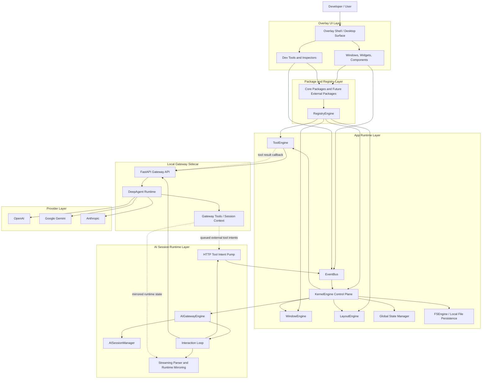

# ACE-Agentic-Client-Environment


> This project is still very early, but the core idea is an overlaying UI that enhances developer productivity through local-first AI assistance, runtime tooling, and extensible desktop workflows.

ACE is a local-first agentic desktop environment built around an overlay UI, an AI gateway sidecar, and a runtime tool/event architecture.

The project is designed to help developers work faster by combining:
- an always-available overlay interface
- AI-assisted chat and orchestration
- local tool execution inside the app
- session context, memory, and retrieval pipelines
- an extensible package ecosystem for custom components, tools, and workflows

In practical terms, ACE is an experimental developer assistant platform where the UI layer, runtime orchestration, and gateway backend are all being shaped into one integrated system.

## ✨ Key Features

- **🌐 Always-on Overlay:** A seamless UI layer that stays on top of your workflow without interrupting it.
- **🧠 Local-First Intelligence:** Privacy-centric AI orchestration using a local gateway sidecar.
- **🛠️ Extensible Toolchain:** Schema-aware tool execution (`ToolEngine`) for local file and system tasks.
- **📡 Event-Driven Architecture:** Robust communication via a central `EventBus` for decoupled UI and logic.
- **📦 Package Ecosystem:** Modular architecture allowing custom widgets, tools, and workflows.

## 💡 Why ACE?

Context switching kills user productivity. Modern AI assistants often live in separate browser tabs or restricted IDE sidebars. ACE aims to bridge this gap by providing a **Unified Agentic Surface** that lives where you work, with direct access to your local runtime and tools given the extendability for window, tool and etc.

## Getting Started

### Prerequisites

- Node.js and npm
- Python 3

### Install Frontend Dependencies

```bash
npm install
```

### Install Gateway Dependencies

You can either install the Python dependencies directly:

```bash
cd src-gateway-server
python3 -m venv .venv
.venv/bin/pip install -r requirements.txt
```

Or use the helper script from the project root:

```bash
npm run setup:gateway
```

### Run The App

Start the frontend app:

```bash
npm run dev
```

Start the gateway server in a separate terminal:

```bash
npm run dev:gateway
```

The typical local workflow is:
1. install npm dependencies
2. install Python gateway dependencies
3. run `npm run dev:gateway`
4. run `npm run dev`

## What This Project Is

ACE is currently an experimental platform for building a local-first AI-native workspace, with a strong focus on developer productivity.

Today, the codebase includes work on:
- overlay and window-based UI primitives
- an AI gateway server for model access and orchestration
- session state, context, memory, and retrieval flows
- local tool execution through an internal event/runtime system
- package-driven extensibility for future third-party or internal feature development

## What Is Currently Done

Even though the project is still early, a meaningful amount of the runtime foundation is already implemented.

What is currently done in the repository:
- a working frontend runtime built with React, Vite, and an Electron/Tauri-oriented desktop shell approach
- a central KernelEngine-based control plane for memory, process lifecycle, runtime state, and orchestration helpers
- an EventBus-driven interaction system for routing actions like tool execution and session events across the app
- a package-oriented architecture with core package domains for components, widgets, tools, windows, and development utilities
- an AI gateway sidecar built with FastAPI and DeepAgents, including `/health`, `/models/{sdk}`, `/test/{sdk}`, and `/chat/{sdk}` endpoints
- provider/model integration plumbing for OpenAI, Google Gemini, and Anthropic through the gateway runtime
- AI session creation, storage, listing, closing, interrupt handling, and per-session state persisted through the frontend runtime
- a streaming chat/request loop that opens a gateway request, mirrors runtime state, persists turn data, and finalizes session status
- runtime snapshot mirroring for planning, context, working memory, and active agent state from the backend into the frontend session state
- a gateway context flow where session context records can be sent to the backend and mirrored back into the live session runtime
- local ACE tool execution through ToolEngine, including schema-aware execution paths and result write-back into session artifacts
- an external ACE tool round-trip flow where the backend can queue tool intents, the frontend fetches them over HTTP, dispatches them into EventBus, and returns results back to the gateway with session and request correlation
- development and debugging surfaces such as session inspection, event monitoring, parser tracing, and tool runner development components
- a non-trivial automated test surface across backend runtime support, gateway tools, parser behavior, event engine behavior, kernel behavior, and related orchestration slices

In short, the project already has a real runtime skeleton in place: app shell, kernel-like control plane, gateway sidecar, session loop, tool execution path, and debugging infrastructure. What is still evolving is the hardening, cleanup, scalability, and consistency of those pieces.

## Architecture Overview

At a high level, ACE is structured as a layered desktop runtime. The top layer is the overlay UI and package-driven React surface. Under that sits the app runtime, which routes events, manages memory and processes, and coordinates windows, tools, layouts, and sessions. The AI path then bridges into a local Python gateway sidecar, which owns model access and the DeepAgents runtime.



### How The Layers Work Together

- The user interacts with the overlay UI, which renders windows, widgets, chat surfaces, and developer monitors.
- Those surfaces are mounted from package definitions and resolved through the registry layer.
- Runtime actions are routed through the app control plane, centered around `KernelEngine`, `EventBus`, and the domain engines such as `WindowEngine`, `ToolEngine`, and `LayoutEngine`.
- AI sessions are managed in the frontend runtime through `AIGatewayEngine`, `AISessionManager`, the interaction loop, and the streaming parser/mirroring layer.
- The frontend talks to the local gateway sidecar over HTTP for health checks, model discovery, test requests, streaming chat, queued tool intents, and tool result callbacks.
- The gateway sidecar runs the DeepAgents-based runtime, binds provider models, manages gateway tools, and returns structured runtime state back to the app.
- External ACE tools are executed inside the app runtime, while the gateway remains the orchestration owner for the AI request lifecycle.


## 🗺️ Current Roadmap

- [x] Core KernelEngine and EventBus Implementation
- [x] AI Gateway with Multi-Provider Support
- [ ] **Phase 1:** Hardening the tool execution pipeline
- [ ] **Phase 2:** Advanced Memory & RAG retrieval systems
- [ ] **Phase 3:** Public Package Registry for community modules

## Long-Term Roadmap

The broader direction of the project is no longer just feature expansion. A major part of the roadmap is hardening and cleaning up the architecture that is currently still heavily vibe-coded and experimental.

Key long-term priorities:
- harden and simplify the gateway runtime so tool execution, session flow, and orchestration are more deterministic and observable
- clean up and stabilize the current architecture so core concepts have clearer boundaries and fewer ad hoc flows
- add stronger windowing and batching systems for context, memory, and retrieval so session state can scale more safely
- improve memory, retrieval, and context assembly into a more reliable pipeline with better lifecycle control
- expand the package registry system so developers can extend the app with their own tools, UI modules, workflows, and runtime integrations

The end goal is an extensible developer environment where AI, runtime tools, overlay UI, package modules, and session intelligence work together in a clean and durable architecture.

## 📄 License

MIT License
Copyright (c) 2026 [Jibril Gilang Ramadhan]