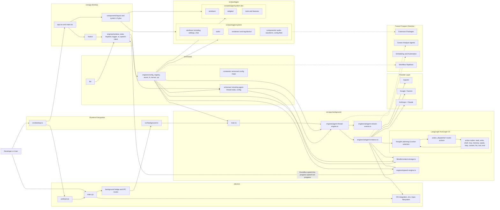

# ACE-Agentic-Client-Environment

<p align="center">
	
</p>


> **⚠️ UNDERGOING MAJOR DEVELOPMENT**
> ACE is currently usable for basic chat and tool execution, but long-running agentic tasks remain unstable. You may encounter noticeable performance issues, incomplete error handling, and breaking changes between commits. Use at your own risk during active sessions.

---------

ACE is a local-first agentic desktop environment built around an overlay UI, an Electron desktop shell, a desktop runtime, and a background agent runtime.

The project is designed to help developers work faster by combining:
- an always-available overlay interface
- AI-assisted chat and orchestration
- local tool execution inside the app
- session context, memory, and retrieval pipelines
- an extensible package ecosystem for custom components, tools, and workflows
- local speech models for Text-to-Speech and Speech-to-Text (ONNX-based, in background runtime)
- a schema-driven configuration system with versioned config maps

In practical terms, ACE is an experimental developer assistant platform where the overlay UI, runtime orchestration, package registry, and agent runtime are already usable, but still moving toward cleaner boundaries.

## ✨ Key Features

- **🌐 Always-on Overlay:** A seamless UI layer that stays on top of your workflow without interrupting it.
- **🧠 Local-First Intelligence:** Privacy-centric AI orchestration with an Electron-hosted background LangGraph runtime and live renderer streaming.
- **⚙️ LangGraph Agent Workflow:** A structured `thought→action_dispatcher→action` cycle with 11+ action nodes (read/write files, shell, MCP tools, memory, speak, step triggers, context toggling), anti-looping rules, and `needs_rethought` recovery.
- **📁 Disk-Backed Context System:** File, directory, and tool context items are persisted to `storage/threads/<uid>/context/` so the agent can reference large project content without keeping everything in memory.
- **🗣️ Local Speech Engine:** ONNX-based TTS (Kokoro-82M) and STT (Whisper) running in the background Node.js runtime with progress streaming to the UI. Model caching with auto-detection of on-disk files.
- **🛠️ Extensible Toolchain:** Registry-loaded tools, package-defined windows/widgets, and runtime-safe bridges for desktop and background capabilities.
- **🔧 Schema-Driven Configuration:** Versioned config maps (`ConfigGeneral`, `ConfigKeybind`, `ConfigAI`, `ConfigSpeech`) with Zod validation and disk-based config storage.
- **📡 Event-Driven Architecture:** Robust communication via a central `EventBus` for decoupled UI and logic, with cross-runtime targeting (`desktop` / `background`).
- **📦 Package Ecosystem:** Modular architecture allowing custom widgets, tools, and workflows.


## 🖥️ Demos

<table width="100%">
  <tr>
    <td width="50%" align="center">
      <!-- GIF 1: Sistem Windowing / Devkit -->
      
    </td>
    <td width="50%" align="center">
	<!-- GIF 2: Proses LangGraph / LangChain -->
      
    </td>
  </tr>
</table>

<p align="center">
  <br />
  <!-- TOMBOL FULL DEMO -->
  <a href="https://youtu.be/f9zeMf6KNdQ" target="_blank">
    
  </a>
</p>

## 💡 Why ACE?

Context switching kills user productivity. Modern AI assistants often live in separate browser tabs or restricted IDE sidebars. ACE aims to bridge this gap by providing a **Unified Agentic Surface** that lives where you work, with direct access to your local runtime and tools given the extendability for window, tool and etc.

## Getting Started

### Prerequisites

- Node.js and npm

### Install Dependencies

```bash
npm install
```

### Configure Provider API Keys

ACE reads provider keys from your shell environment through the Electron main process and exposes only an allowlisted subset to the renderer.

For example in `~/.zshrc`:

```bash
export OPENAI_API_KEY="your-key"
export ANTHROPIC_API_KEY="your-key"
export GOOGLE_API_KEY="your-key"
```

Then restart your terminal and Electron dev process.


### Run The App

Start the desktop app:

```bash
npm run start
```

```bash
npm run dev
```

This starts:
- the Vite renderer dev server
- the Electron main process

### Temporary Filesystem Security Note
MVP Security Notice: ACE intentionally runs its LangGraph-driven background agent runtime with permissive read/write filesystem access and broad command execution capabilities across the mounted home directory. This is a deliberate, temporary tradeoff to maximize MVP velocity—allowing the agent to inspect, edit, and rewrite project artifacts via batch scripts and shell helpers without friction while the core runtime contracts are still settling. This current posture is not a hardened least-privilege policy; it should be treated as an accepted security issue for rapid iteration that requires strict route-scoped and tool-scoped permission layers before any production release.

### Deep Dive & Developer Logs
For a more detailed technical breakdown, architectural logs, and the journey of building ACE, check out my blog:
👉 **[jiran.dev/projects/ace](https://jiran.dev/projects/ace)**

## Architecture Overview



### How The Layers Work Together

- `src/desktop.ts` boots the renderer-side runtime by composing desktop-facing engines such as `WindowEngine`, `StateEngine`, `KeybindEngine`, `LoggerEngine`, and desktop `AgentClientEngine` on top of shared contracts.
- `src/app-desktop/` owns renderer UI, hooks, window shells, and interaction logic, while package windows and widgets from `src/packages/system/` and `src/packages/system-dev/` provide much of the actual mounted UI surface. Speech progress events are consumed directly in React components via `useAceEvent().listen()`.
- `src/shared/engines/` contains the common control-plane layer, especially `KernelEngine`, `RegistryEngine`, `ConfigEngine`, `EventBus`, and filesystem-facing shared runtime contracts. `src/shared/constants/config.ts` holds versioned Zod-based config schema maps for general, keybind, AI, and speech settings.
- Electron `main.cjs`, `preload.cjs`, and the background bridge connect the desktop runtime to host capabilities such as environment access, filesystem access, global input, and background IPC.
- `src/background.ts` and `src/app-background/main.ts` boot the dedicated background runtime, where background `AgentThreadEngine` invokes the LangGraph agent instance and emits protocol stream updates back toward the renderer.

### LangGraph Agent Workflow (AceGraph V3)

The agent workflow follows a structured graph cycle:

1. **Thought Node** — The LLM plans the next actions, selects tools, and produces a structured `ThoughtAction` array with a `status` field (`pending | running | done | failed | needs_rethought`). It also manages `contexts` (file/directory items the agent considers relevant) and `memories` (persistent notes).
2. **Action Dispatcher** — Routes each action to the correct handler node. If an action is marked `needs_rethought`, the dispatcher collects feedback and routes it back to the thought node for re-planning.
3. **Action Nodes** (11 total):
   - `action_read_file` / `action_write_file` — Read/write file content with progress streaming
   - `action_list_directory` — List directory contents
   - `action_shell` — Execute shell commands with batched execution and progress XML tags
   - `action_tool` — Run registered ACE tools
   - `action_mcp` — Invoke Model Context Protocol tools
   - `action_memory` — Manage persistent memory entries
   - `action_speak` — Emit assistant messages to the chat UI
   - `action_step` — Step trigger conditions for multi-step workflows
   - `action_context` — Toggle context items (expand/collapse file content references)
   - `action_end` — Signal workflow completion
4. **Context System** — File, directory, and tool content are persisted to disk under `storage/threads/<uid>/context/`. The thought node references them by pointer; `action_context` toggles expansion of specific items. `buildContextSection()` reads content from disk on demand to avoid bloating the LLM prompt.
5. **Anti-Looping & Recovery** — The system tracks cycle counts per action, enforces `MAX_CYCLES = 40`, detects repeated identical actions, and can mark stuck actions as `needs_rethought` for recovery.

### Speech Engine

The `SpeechEngine` runs in the background (Node.js) runtime and provides:
- **TTS** (Text-to-Speech) via `@huggingface/transformers` v3 using ONNX-optimized Kokoro-82M model (`AutoTokenizer` + `AutoModel` direct inference with speaker/style/speed tensors)
- **STT** (Speech-to-Text) via Whisper ONNX pipeline (`automatic-speech-recognition` with auto language detection)
- Model caching with auto-detection of on-disk files under `~/.config/AceAssistant/models/`
- Progress events streamed to the desktop via `EventBus` (`speech:tts-progress`, `speech:stt-progress`)
- The UI renders progress bars using `<AudioWaveform>` and download status in the Settings → Speech section

### Schema-Driven Configuration

Configuration is schema-driven with versioned maps:
- `ConfigGeneral_V0_0_0_SchemaMap` — General app settings
- `ConfigKeybind_V0_0_0_SchemaMap` — Keybinding settings
- `ConfigAI_V0_0_0_SchemaMap` / `ConfigAI_V0_0_1_SchemaMap` — AI provider and model config
- `ConfigSpeech_V0_0_0_SchemaMap` — Speech model paths and settings

Each schema map is validated with Zod and stored via `ConfigEngine` with disk persistence through the kernel space.

### AI Streaming & Thread Sync

- AI streaming and persisted thread synchronization flow through shared kernel state so windows like chat and monitors can reflect both live and durable runtime state.
- `AgentClientEngine` (desktop) syncs thread state (`steps`, `contexts`, `memories`, `cycles`) periodically with `AgentThreadEngine` (background).
- Thread state is serialized via `AgentClientThreadStateType` which includes full step history and context items.
- The architecture already reflects a practical split between desktop, background, shared, electron, and package layers; the main ongoing task is reducing leakage between those real surfaces rather than inventing a new separation model.

## 🛠️ Technology Stack

| Layer | Technology | Purpose |
|-------|-----------|---------|
| **Desktop Shell** | Electron 35+ | Cross-platform desktop shell, main/preload IPC, OS integration |
| **UI Framework** | React 19 + TypeScript | Component-based renderer UI |
| **Bundler** | Vite 7 | Dev server and build tooling |
| **Agent Framework** | LangGraph (`@langchain/langgraph` v1.3) | Structured `thought→action` graph workflow with conditional edges, state management, and interrupt gates |
| **AI Providers** | LangChain (`@langchain/core` + provider SDKs) | OpenAI, Anthropic (Claude), Google (Gemini) integration |
| **ONNX Inference** | `@huggingface/transformers` v3 | Local TTS (Kokoro-82M) and STT (Whisper) model inference in Node.js |
| **STT / TTS** | Kokoro-82M-ONNX + Whisper ONNX | Speech-to-text and text-to-speech via ONNX runtime in background |
| **Streaming** | Server-Sent Events + EventBus | Live agent output and progress streaming to renderer |
| **Event System** | Custom EventBus | Decoupled cross-runtime communication with `target` routing |
| **IPC / RPC** | Electron IPC + Custom RPCEngine | Background ↔ Desktop bridge for method invocation |
| **Config** | Zod schemas + versioned config maps | Type-safe, disk-persisted configuration |
| **Styling** | Tailwind CSS 4 | Utility-first UI styling |
| **Packaging** | Custom Registry Engine | Dynamic tool, widget, and window registration |
| **Testing** | Vitest | Unit and feature testing |

## Future Prospects

The future direction of ACE is not only “more chat features”. The longer-term goal is to turn the current overlay plus runtime foundation into a programmable agentic workstation where AI can operate with stronger situational awareness, controlled automation, and package-level extensibility.

Some of the clearest next prospect areas are:
- **Extension Packages:** a stronger package contract so third-party or internal modules can contribute windows, widgets, tools, parsers, workflows, and background capabilities without patching the core runtime directly.
- **Screen Analyze Agentics:** a future agent layer that can reason about the visible desktop state more directly, including screen context, active windows, layout state, and eventually richer screen analysis for UI-aware assistance.
- **Scheduling and Background Automation:** scheduled tasks, recurring jobs, reminder-like automations, queued workflows, and agent-triggered routines that continue running in the background runtime.
- **Workflow Pipelines:** more explicit multi-step agent workflows for coding, research, project setup, local automation, and cross-tool orchestration instead of only single-turn chat interactions.
- **Assistive System Surfaces:** richer monitors, planners, execution dashboards, runtime inspectors, and package-provided operational windows so agent behavior is easier to inspect and control.
- **Safer Execution Contracts:** tighter policy layers for filesystem access, tool permissions, scheduling ownership, and package isolation so future automation remains observable and bounded.

Put differently: the present repository is the start of a local-first agent runtime plus overlay shell, while the future prospect is a broader extensible workstation where packages, automation, memory, vision-like screen analysis, and agent scheduling all compose cleanly around the same kernel and registry model.

## 📄 License

GNU General Public License v3.0

See the [LICENSE](./LICENSE) file for the full text.

Copyright (c) 2026 Jibril Gilang Ramadhan
