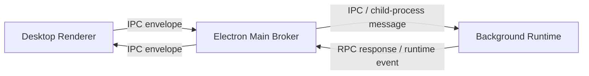

# IPC, Runtime, and RPC Architecture

This document explains how ACE moves messages between runtimes, where route handlers live, how route ownership is coordinated, and how duplicate RPC registrations are prevented.

## Runtime Surfaces

ACE runs across three different runtime surfaces:

1. **Electron Main Process**
   * Owns the native Electron app lifecycle.
   * Creates the main `BrowserWindow`.
   * Spawns the background runtime as a child process.
   * Acts as a transport broker and route-claim coordinator.
   * Does **not** own application RPC route definitions or handlers.

2. **Desktop Renderer Runtime**
   * Runs inside Chromium in the Electron window.
   * Owns the DOM, React tree, overlays, renderer state, and virtual ACE windows.
   * Contains desktop-only engines such as `WindowEngine`.

3. **Background Runtime**
   * Runs as a separate Node.js child process.
   * Owns orchestration, AI execution, and non-UI runtime logic.
   * Has its own engine instances and memory space.

These runtimes do **not** share a memory heap. Shared files under `src/shared/` are shared contracts and implementations, not shared process state.

## Transport Semantics

ACE uses two different messaging semantics:

1. **EventBus**
   * Fire-and-forget.
   * One-to-many or zero-to-many.
   * No response is expected.
   * Best for notifications, streams, and lifecycle-style signals.

2. **RPCEngine**
   * Fire-and-wait.
   * One request targets one runtime.
   * Exactly one runtime may own a route at a time, and that runtime should expose exactly one local handler for it.
   * Best for commands or queries that require a result or failure response.

Rule of thumb:

* Use `EventBus.emit(...)` when the caller does not need a reply.
* Use `RPCEngine.invoke(...)` when the caller expects a result.

## High-Level Runtime Flow



Electron main is the broker. It forwards envelopes. It should stay thin.

Electron main should **not** become the source of truth for:

* domain route semantics
* handler implementation
* engine-local routing policy

Electron main **does** keep the authoritative claim ledger for one narrow concern: serializing exclusive route ownership between runtimes. It knows which runtime currently owns a route so claims cannot race, but it does not define what the route means or how the route is executed.

Those concerns are split between `RPCEngine` inside each runtime and a route-claim coordinator in Electron main.

## EventBus Flow

EventBus is local first.

Inside a runtime:

1. An engine calls `EventBus.emit(slug, payload)`.
2. All local listeners for that slug are notified.
3. No response is expected.

Across runtimes:

1. A runtime emits a transport event targeted to another runtime.
2. Electron main relays the event envelope.
3. The receiving runtime injects that message into its local `EventBus`.
4. Local listeners handle it.

EventBus does not guarantee a single owner and does not prevent multiple listeners from subscribing to the same slug.

## RPC Flow

RPCEngine is runtime-local in handler execution, but cross-runtime in route ownership and invocation.

### Local Registration

Each runtime has its own in-memory handler map.

In addition, ACE maintains a mirrored RPC route registry in kernel memory inside each runtime. That registry is synchronized from Electron main, which acts as the authoritative claim coordinator.

Examples:

* Desktop runtime claims and handles window routes like `window.list`, `window.get`, `window.spawn`.
* Background runtime claims and handles AI routes like `ai.readThread`, `ai.syncThread`, `ai.deleteThread`.

Routes are registered during engine boot through `setupRpcRoutes()`.

### Claim Coordination

Route registration is not considered complete until Electron main approves the claim.

The flow is:

1. An engine calls `RPCEngine.handle(route, handler, { owner })`.
2. The runtime sends an `ace:rpc:claim-route` message to Electron main.
3. Electron main checks the authoritative route ownership table.
4. If the route is free, Electron main commits the claim.
5. Electron main returns `ace:rpc:claim-route:result` to the claimant.
6. Electron main broadcasts `ace:rpc:registry-sync` so every runtime mirrors the same ownership table into kernel memory.
7. Only after approval does the runtime activate the local handler.

This is what prevents split-brain route ownership.

### Invocation

When code calls:

```ts
await RPCEngine.invoke('window.list', {});
```

the flow is:

1. `RPCEngine` reads the mirrored route registry from kernel memory.
2. It resolves which runtime currently owns `window.list`.
3. If the owner is the current runtime, the request runs locally.
4. If the owner is another runtime, `RPCEngine` creates a request envelope with:
   * request id
   * source runtime
   * target runtime
   * route
   * payload
5. Electron main relays that envelope.
6. The target runtime receives it.
7. The target runtime executes the local handler.
8. The target runtime sends a response envelope back.
9. The source runtime resolves or rejects the pending promise.

### If the Target Has No Handler

If the route is not present in the synchronized registry, invocation fails before dispatch.

Example:

* `RPCEngine.invoke('window.list', {})` succeeds if desktop owns `window.list`.
* `RPCEngine.invoke('ai.readThread', {...})` succeeds if background owns `ai.readThread`.
* `RPCEngine.invoke('unknown.route', {})` fails because no runtime has successfully claimed it.

This is expected. Route ownership is runtime-specific.

## Registry Ownership

The most important rule is this:

**RPC handler functions are local per runtime, but route ownership is globally coordinated by Electron main.**

That means:

* Desktop has one local handler map.
* Background has one local handler map.
* Electron main keeps the authoritative cross-runtime ownership table.
* Each runtime mirrors that ownership table into kernel memory.

This is intentional because:

* desktop and background are different processes
* they do not share handler functions
* Electron main must serialize claims to prevent two runtimes from owning the same route at once

## Duplicate Prevention

Duplicate prevention now has two layers.

### 1. Cross-Runtime Ownership Prevention

Electron main prevents two runtimes from claiming the same route.

Example:

* Background claims `ai.readThread`
* Desktop later tries to claim `ai.readThread`
* Electron main rejects the second claim

This is the authoritative duplicate-prevention layer.

### 2. Local Runtime Duplicate Prevention

Inside a runtime, `RPCEngine` still prevents duplicate local handler registration.

Example:

```ts
RPCEngine.handle('window.list', handler, { owner: 'WindowEngine' });
```

If another engine in the same runtime tries to register `window.list` again, the local runtime throws immediately.

### What Counts as a Duplicate

These are duplicates:

* Desktop `WindowEngine` registers `window.list`
* Desktop `OtherEngine` also registers `window.list`

These are also duplicates:

* Background claims `ai.readThread`
* Desktop tries to claim `ai.readThread`

These are **not** duplicates:

* Desktop registers `window.list`
* Background registers `ai.readThread`

So the effective rule is:

* one route may have exactly one owner runtime at a time
* within that owner runtime, one route may have exactly one active local handler

## Why Duplicate Prevention Is Not in Electron Main

Electron main is still only a transport broker for domain requests, but route claims are a coordination problem. To prevent split-brain ownership, Electron main must serialize claims.

Electron main does **not** define what a route means. It only decides whether a route claim is allowed.

If duplicate prevention did not include Electron main, two runtimes could race to claim the same route and briefly diverge.

Electron main does not need to know:

* business implementation details of the route
* handler function logic
* engine internals beyond the owner metadata included in the claim

That keeps Electron main as a coordinator, not a domain router.

The correct layering is:

1. **Electron Main**
   * transport broker
   * serializes route claims
   * broadcasts synchronized registry state

2. **RPCEngine**
   * owns handler registration
   * requests route claims
   * prevents local duplicates
   * tracks pending requests
   * resolves responses
   * mirrors the synchronized registry into kernel memory

3. **Engines**
   * define business routes in `setupRpcRoutes()`

## Engine Lifecycle

Every engine can expose:

* `boot()`
* `setupKernelSpace()`
* `setupEventRoutes()`
* `setupRpcRoutes()`
* `setupKernelTerminationHook()`

`setupRpcRoutes()` exists so route registration happens once and in one predictable place.

Example:

* `WindowEngine.setupRpcRoutes()` registers desktop window routes.
* `AIEngine.setupRpcRoutes()` registers background AI routes.

This keeps route ownership close to the engine that actually implements the behavior.

## Current Responsibility Split

### Electron Main

Responsible for:

* bridging renderer IPC and child-process messaging
* serializing route claims
* relaying RPC envelopes
* broadcasting registry sync
* relaying runtime events
* maintaining process lifecycle

Not responsible for:

* owning domain route definitions
* implementing route handlers

### Desktop Runtime

Responsible for:

* UI state
* DOM-backed ACE windows
* desktop-only route handlers such as window RPC routes

### Background Runtime

Responsible for:

* AI orchestration
* background-only route handlers such as AI RPC routes
* long-lived runtime logic that does not require direct UI access

## Mental Model

Use this mental model when designing new transports:

* **EventBus** = publish/notify
* **RPCEngine** = request/response + local handler ownership
* **Electron Main** = courier + route-claim coordinator
* **Desktop Runtime** = UI and virtual window owner
* **Background Runtime** = orchestration and execution owner

If the caller needs a result, use RPC.

If the caller only needs to signal something happened, use EventBus.

If you are deciding where duplicate prevention belongs:

* local duplicate prevention belongs in `RPCEngine`
* cross-runtime claim arbitration belongs in Electron main