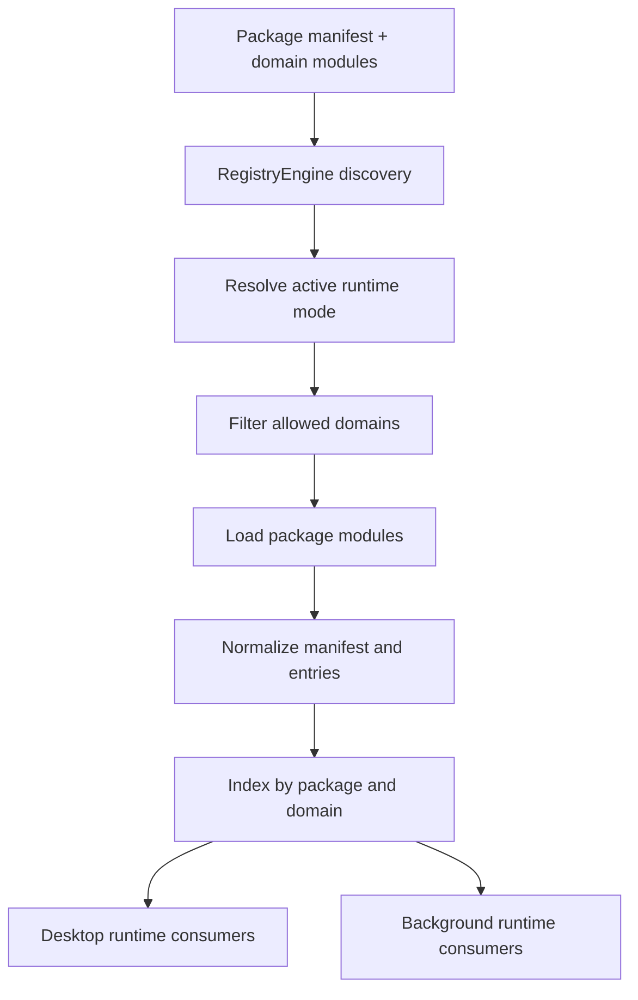

# Package Registry Architecture

This document explains how the ACE package registry is structured, how registry domains are loaded, and how different domains participate in desktop and background runtimes.

## Purpose

The package registry is ACE's modular extension layer. It allows package-defined windows, widgets, tools, components, renderers, and other domains to be discovered and mounted without hard-wiring every feature into the core runtime.

The registry is not just a file loader. It is a runtime contract system for package-owned capabilities.

## Core Mental Model

A package contributes a manifest plus one or more domain entries.

At boot time, `RegistryEngine`:
- discovers packages
- loads only the domains allowed for the active runtime
- normalizes package metadata
- indexes entries for O(1) lookup
- publishes package summaries for diagnostics and runtime inspection

The central implementation lives in [src/shared/engines/registry-engine.ts](/home/itsjiran/Workspace/sideproject/260310_assist/src/shared/engines/registry-engine.ts).

## Package Structure

A package typically contains:
- `manifest.json`
- `widgets/`
- `components/`
- `windows/`
- `tools/`
- `features/`
- `processes/`
- `pipelines/`
- `registries/`
- `renderers/`

Each package declares its identity in the manifest and contributes domain entries that are later indexed by `RegistryEngine`.

## Registry Contracts

There are two key schema surfaces:

- [src/shared/schemas/registry-types.ts](/home/itsjiran/Workspace/sideproject/260310_assist/src/shared/schemas/registry-types.ts)
  - author-facing declaration types for package modules
  - describes what a widget, window, tool, renderer, or other domain should look like

- [src/shared/schemas/registry.ts](/home/itsjiran/Workspace/sideproject/260310_assist/src/shared/schemas/registry.ts)
  - normalized runtime-facing registry schema
  - defines package manifests, domain entries, locators, and runtime metadata

Think of `registry-types.ts` as package author ergonomics and `registry.ts` as runtime normalization.

## Runtime Domain Loading

Registry loading is runtime-aware.

`RegistryEngine` resolves the active runtime mode and only loads the domains permitted for that runtime policy. This means package loading is not all-or-nothing.

That matters because desktop and background runtimes do not own the same responsibilities.

## Domains That Primarily Belong to Desktop

These domains are mainly presentation or renderer oriented:
- `windows`
- `widgets`
- `components`
- `renderers`

Typical usage:
- windows are spawned and managed by desktop window orchestration
- widgets are surfaced in launcher or auto-start UI flows
- components render inside window shells
- renderers adapt structured payloads into desktop-facing UI blocks

Examples of desktop consumption appear in:
- [src/app-desktop/engines/window-engine.ts](/home/itsjiran/Workspace/sideproject/260310_assist/src/app-desktop/engines/window-engine.ts)
- [src/desktop.ts](/home/itsjiran/Workspace/sideproject/260310_assist/src/desktop.ts)

## Domains That Primarily Belong to Background

These domains are mainly execution or orchestration oriented:
- `tools`
- `processes`
- `pipelines`
- parts of `features`

Typical usage:
- tools are resolved into callable agent or runtime actions
- processes represent background or observable task units
- pipelines model multi-step workflows
- features may bind actions into behavior that is runtime-dependent

A concrete example is the AI tool surface resolving registry tools in:
- [src/app-background/engines/ai/agent-tool-registry.ts](/home/itsjiran/Workspace/sideproject/260310_assist/src/app-background/engines/ai/agent-tool-registry.ts)

## Domains That Can Cross Runtime Boundaries

Some domains are conceptually shared but operationally runtime-specific.

Examples:
- `features`
- `registries`
- metadata-bearing `renderers`

The package may be shared as code, but the actual loaded implementation still depends on runtime load policy and execution context.

## Registry Flow

## Package Resolution Model

`RegistryEngine` stores runtime package data in an index that contains:
- manifest metadata
- normalized package object
- domain maps keyed by slug

That allows fast lookup patterns like:
- package by ref
- domain entry by package + domain + slug
- package list for diagnostics

This is why the registry behaves more like a runtime index than a simple loader.

## Why This Matters Architecturally

The registry allows ACE to evolve as a package-first workspace instead of a monolithic desktop app.

Benefits:
- new tools can be added without patching core agent code every time
- windows and widgets can be introduced as package-level capabilities
- renderers can specialize tool output presentation without coupling UI logic to every tool implementation
- runtime-specific load policies can grow stricter over time

## Design Constraints

To keep the registry healthy:
- domain ownership must remain explicit
- runtime load policy must stay intentional
- package contracts must be schema-driven
- registry modules should not assume direct access to foreign runtime internals

A package entry should expose a capability, not smuggle transport assumptions.

## Recommended Rule of Thumb

When deciding where a package domain belongs, ask:

1. Is this mainly presentation or execution?
2. Which runtime owns the side effects?
3. Does the domain need browser APIs, Node APIs, or neither?
4. Should the result be rendered, executed, observed, or indexed?

The answers usually reveal whether the domain belongs to desktop, background, or should remain only as shared contract metadata.
