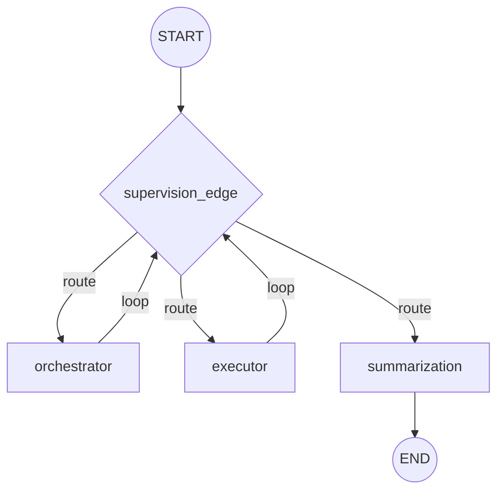
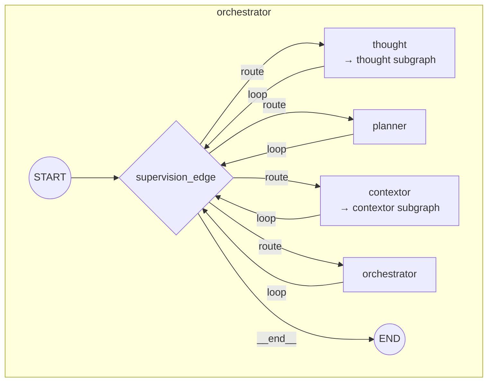
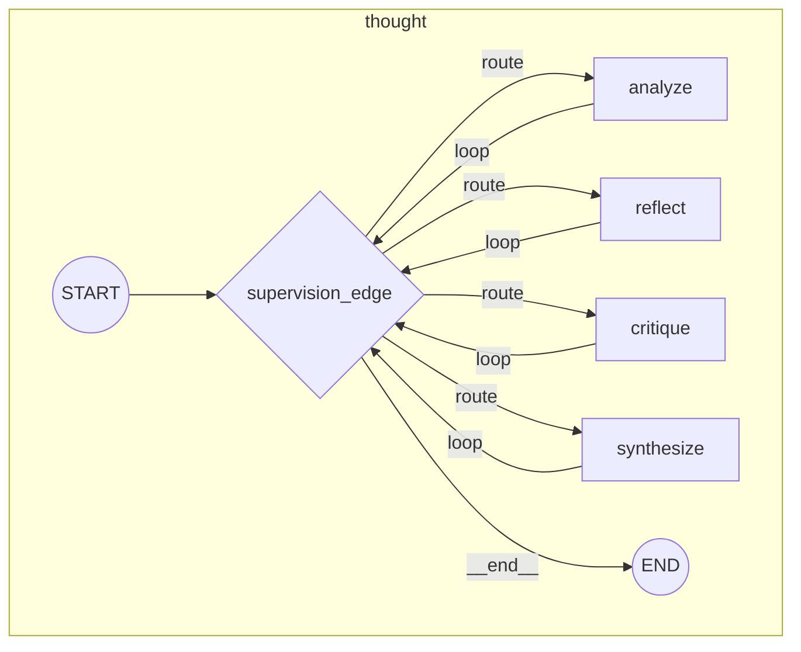
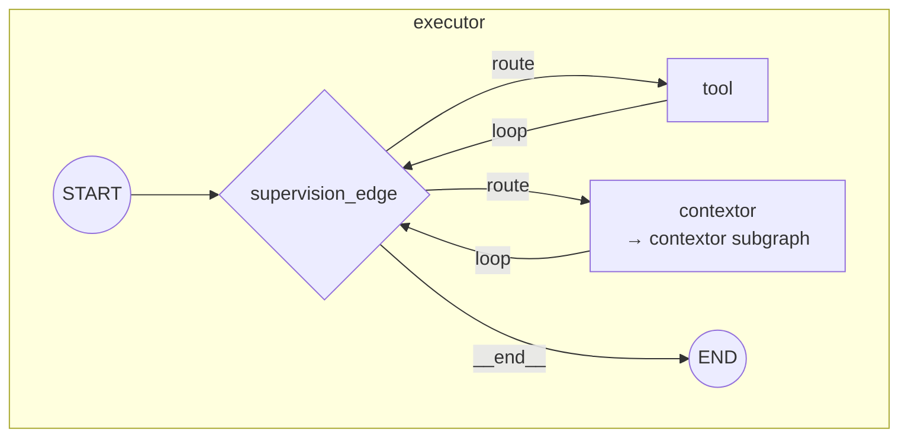
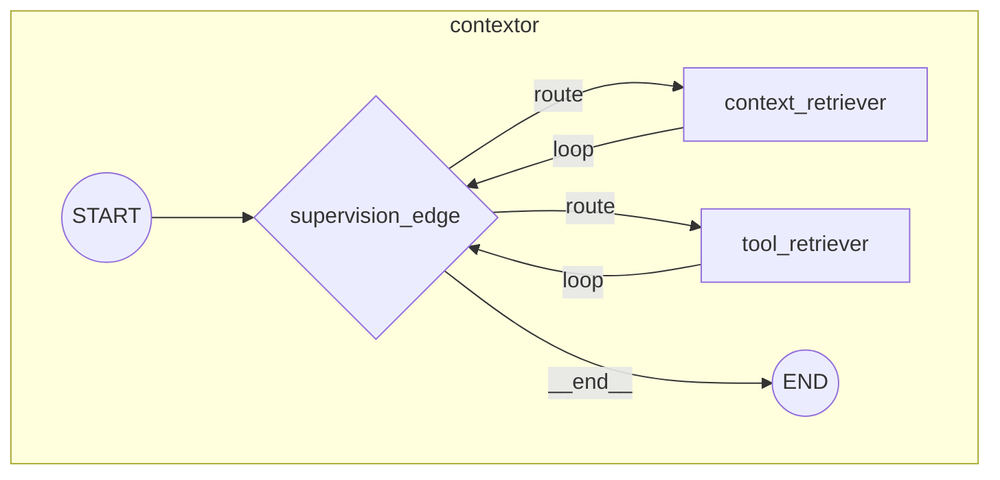
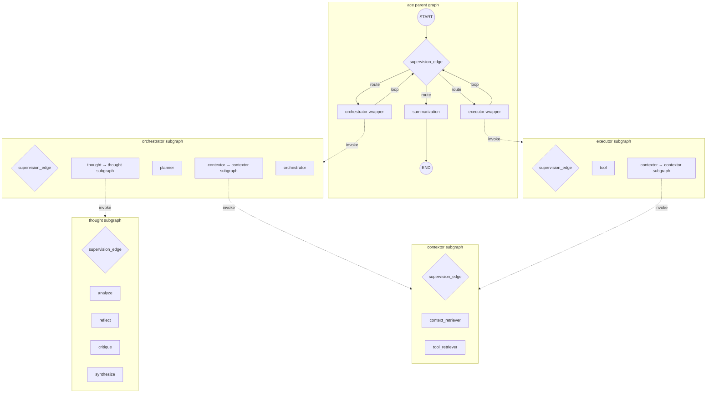

# ACE Graph v1 — Workflow Hierarchy

## Parent Graph: `ace`

## Subgraph: `orchestrator`

## Subgraph: `thought`

## Subgraph: `executor`

## Subgraph: `contextor`

## Full Cross-Graph Delegation

## Node Reference

| Graph | Node | Type | Delegates to |
|-------|------|------|--------------|
| `ace` | `supervision_edge` | conditional edge | — |
| `ace` | `orchestrator` | wrapper node | `orchestrator` subgraph |
| `ace` | `executor` | wrapper node | `executor` subgraph |
| `ace` | `summarization` | LLM node | — |
| `orchestrator` | `supervision_edge` | conditional edge | — |
| `orchestrator` | `thought` | wrapper node | `thought` subgraph |
| `orchestrator` | `planner` | LLM node (structured output) | — |
| `orchestrator` | `contextor` | wrapper node | `contextor` subgraph |
| `orchestrator` | `orchestrator` | LLM node (structured output) | — |
| `thought` | `supervision_edge` | conditional edge | — |
| `thought` | `analyze` | LLM node | — |
| `thought` | `reflect` | LLM node | — |
| `thought` | `critique` | LLM node | — |
| `thought` | `synthesize` | LLM node | — |
| `executor` | `supervision_edge` | conditional edge | — |
| `executor` | `tool` | tool execution node | — |
| `executor` | `contextor` | wrapper node | `contextor` subgraph |
| `contextor` | `supervision_edge` | conditional edge | — |
| `contextor` | `context_retriever` | retrieval node | — |
| `contextor` | `tool_retriever` | retrieval node | — |
