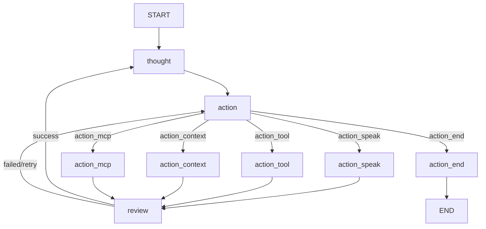

# ACE Graph v3 — Flow Diagram

## Node Descriptions

| Node | Role |
|---|---|
| `thought` | Stage 1: Observe & Assess — analyze user prompt + previous results |
| `action` | Stage 2: Classify & Route — decide which sub-action to take |
| `action_speak` | Respond to user with natural language |
| `action_tool` | Execute code, commands, install packages (PENDING) |
| `action_context` | Read files, inspect state, gather info (PENDING) |
| `action_mcp` | Model Context Protocol integration (PENDING) |
| `action_end` | Gracefully terminate — produce final message → END |
| `review` | Stage 3: Evaluate — classify success/failure, summarize |

## Cycle Flow

1. **thought** analyzes the subject → outputs `cycle.thought`
2. **action** classifies based on `cycle.thought` → routes to sub-action
3. **sub-action** executes (or returns unavailable)
4. **review** evaluates the result:
   - Failed → redirect to `action` (try different approach)
   - Success → summarize → redirect to `thought` (next cycle)
5. **thought** eventually classifies as `end` → **action** routes to `action_end` → END
